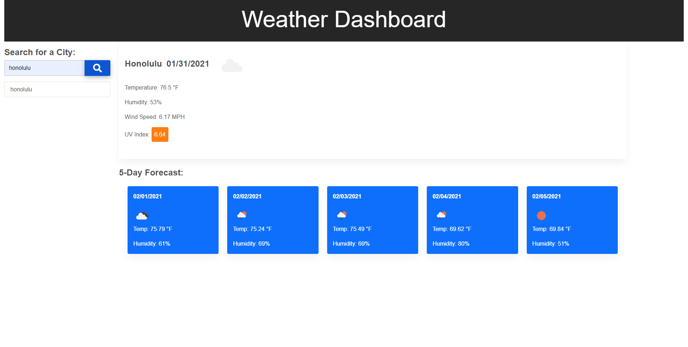

# Weather-Dashboard

## Description 

A weather dashboard where the user can type in a city name and get the current day's forecast as well as the forecast for the next five days. The weather data is populated using the OpenWeather API.

## Technologies
* Google Fonts
* Font Awesome
* Material Design for Bootstrap
* CSS Animate
* HTML
* CSS
* JavaScript
* jQuery

## Screenshot

## URL

https://crrmarchese.github.io/Weather-Dashboard/